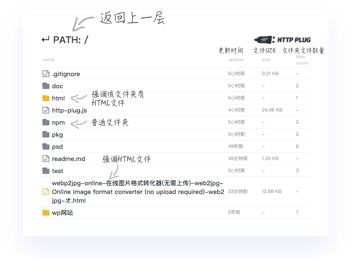
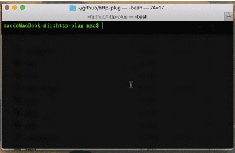

<center>




</center>
<p align="center">


</p>
# http-plug

### node实现的无依赖http静态服务器。

        一开始我使用[xammp](https://www.apachefriends.org/)里的web server做静态服务器，需求很简单，就是偶尔调试下html。首先我得先把文件拷贝到web server指定的目录下才能访问，虽然可以设置路径，但还是觉得麻烦。
        
        难道就没有一个可以非常便捷的在任意目录下创建静态服务器的工具吗？
        就像一个插头🔌,插上马上就能用。
        接着我本着尽可能简单的原则，只使用node自带模块来开发这个工具


http-plug有以下几点优势。

* [x] 非常迷你,无依赖,30KB不到
* [x] 全局命令,哪里需要点哪里
* [x] html页面改动实时刷新
 


# 安装
### 模块安装
#### 全局安装(推荐)

```
npm i http-plug -g
```

> 我的实际输入：sudo [cnpm](https://developer.aliyun.com/mirror/NPM?from=tnpm) i http-plug -g

进入任意文件夹下输入
```
plug
```
即可在这个文件夹下创建http-plug

使用 `-h` `-H` `-help`获取更多使用帮助
```
plug -h
```
#### 局部安装
进入项目文件夹输入
```
npm i http-plug --save-dev
```
接着使用node自带的`npx`启动，获取帮助信息可输入`npx http-plug -v`
```
npx http-plug
```
